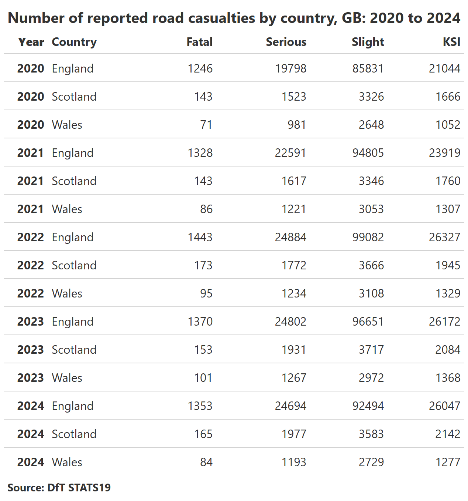

# Stats19 insights

Some analysis of the latest Stats19 data released in September 2025 for
the period 2020 to 2024.

# Casualties by country

The table below shows a breakdown of all casualties by country and year.

 Comparing Killed or Seriously injured
casualties (KSI) for the past 5 years relative to their 2020 value for
collisions taking place in Rural and Urban locations shows a trend in
Wales similar to England and Scotland in Rural areas. Whilst for Urban
areas Wales breaks the trend of England and Scotland with a marked
downward trend since 2022.

 \|
 \|

For Pedestrian and Cyclist casualties in Urban areas, the drop in Wales
is even more pronounced.

# Pedestrians on pavements

The table below shows the breakdown of pedestrian casualties by
position. Nearly 12% of casualties KSI were on pavements or verges.

25 of the 45 pedestrians killed in collisions on pavements or verges
were single vehicle collisions with people driving 4 wheel motorised
vehicles. A breakdown of the vehicle type is shown in the plot below
(each square is a pedestrian casualty coloured by the vehicle involved).
Of the 16 collisions involving more than one vehicle all involved people
driving 4 wheel motor vehicles, with 1 collision also including a person
cycling a pedal cycle.  For pedestrians KSI in
collisions involving single vehicles on pavements around 20% were pedal
cycles or micromobility vehicles, or uncategorised. A full breakdown is
shown in the plot below. 

# HGVs on motorways

In 2024, despite making up only 12% of motorway miles, people driving
HGVs were involved in nearly 30% of fatal collisions. The plot below
shows the percentage of both HGV miles and HGV fatal collisions for each
year since 2020. Whilst the proportion of miles on British motorways
driven by people in HGVs has been dropping, their involvement in Fatal
collisions has gone up slightly.

